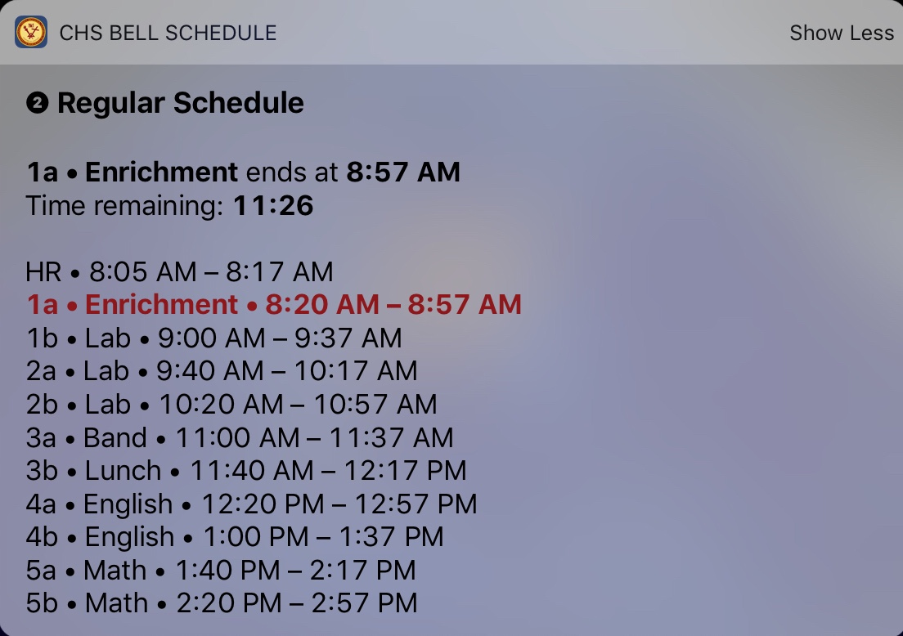

# Bell Schedule

In the app, the Bell Schedule view can be found in Events, then by tapping the 'Bells' button in the top right. During the school day, this button will say 'Period x starts/ends at (time)'. Note that this button will not appear on weekends or (most) no school days. 

At all times on school days cycle day is indicated by the round number,the schedule type is indicated by the bold title, and the day's bells are displayed below. The next bell (ex: Period 1a ends at 8:57 AM) and the time remaining until that bell are displayed below the title before and during school. 

## How it Works

The Bell Schedule is configured automatically based on the type of schedule (Mass, Assembly, etc.) and the cycle day. Both of these are determined based on the events calendar. 

A few things to note:

* Because the schedule relies on the calendar, the app must be opened to refresh the schedule in the event there is a schedule change. 
* 'Special' mass or assembly schedules are not supported at this time. 

## Add the Bell Schedule Widget

Another convenient feature of the Bell Schedule is the widget that lives in the Today View. The Today View can be reached to the left of either your lock screen or home screen. 

To add the widget:

1. Unlock your device
2. Go to the today view
3. Scroll to the bottom and tap the 'Edit' button
4. Scroll down to the 'More Widgets' section and tap to add 'CHS Bell Schedule'

The widget has two modes: collapsed and expanded. Tap the 'Show More' or 'Show Less' button to toggle this.

The widget is designed to operate independent from the app for as long as the calendar runs (up to 60 days). However, if the bell schedule changes, the only way the widget will know this is if the app is opened. 

## Set Your Own Class Schedule

⚠️ Ensure your app is updated to version 1.5 or greater to use this feature.

By inputting your own classes and rooms, the Bell Schedule feature will automatically show your schedule for the current cycle day. 

Go to Settings > Set Class Schedule, and fill in the fields for each cycle day.  

When viewing the widget, you can tap once anywhere on the text to switch the display between class and room.
 

