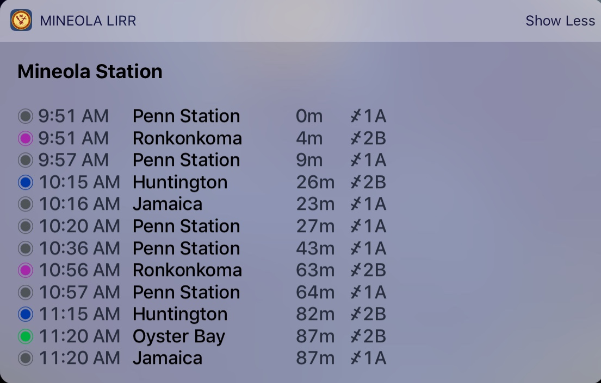

# Mineola LIRR Arrivals Widget

Using the LIRR widget, you can view arriving trains at Mineola Station. 

In order, the columns display: line color, destination, schedule time, estimated time of arrival/status, & track number.

## How it Works

The widget fetches train information from the MTA every 15 seconds. 

A few things to note:

* If a train is cancelled or held, the estimated arrival will display 'CANC' or 'HELD', respectively.
* An internet connection is required for the widget.
* A train may show as arriving (flashing 0m) for longer than the train is actually at the station.
* As a general rule of thumb, predict that the arrival time will be accurate to plus or minus 2 minutes. Don't rely on it if you're extremely tight on making a train.

## Add the LIRR Widget

To add the widget:

1. Unlock your device
2. Go to the today view
3. Scroll to the bottom and tap the 'Edit' button
4. Scroll down to the 'More Widgets' section and tap to add 'Mineola LIRR'

